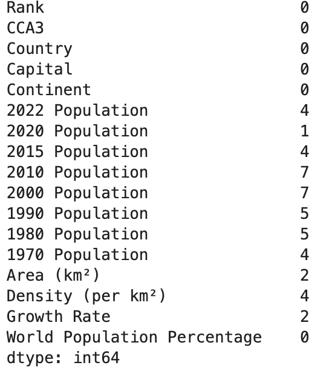
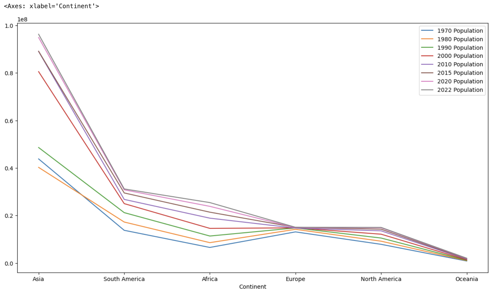

# World Population Analysis

---

## Overview

This project explores historical world population data, providing insights into trends across countries and continents. It generates correlation matrices, line plots, and box plots to identify patterns, outliers, and growth trends.

## Features

- Data cleaning and exploratory analysis
- Null value and uniqueness checks
- Correlation heatmaps
- Continent-wise population aggregation
- Transposed plots for time series visualization
- Boxplots for detecting outliers

---

## Requirements

Install the required Python packages:
```bash
pip install pandas seaborn matplotlib

You also need:

- Python 3.7

## How to Run

1. Open the Jupyter Notebook:
   ```bash
   jupyter notebook "Word Population Pandas Analysis.ipynb"
   ```
2. Run all cells to fetch and visualize data.

## Example Output
The notebook generates plots showing population data analysis and correlations.








